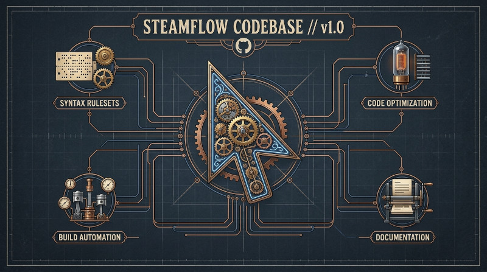
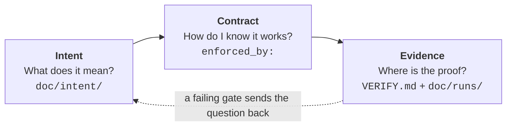
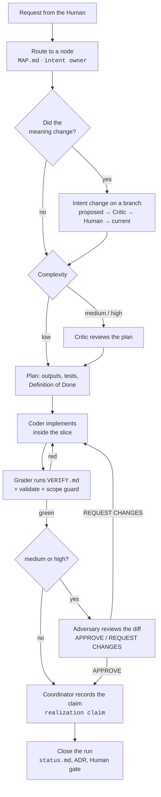
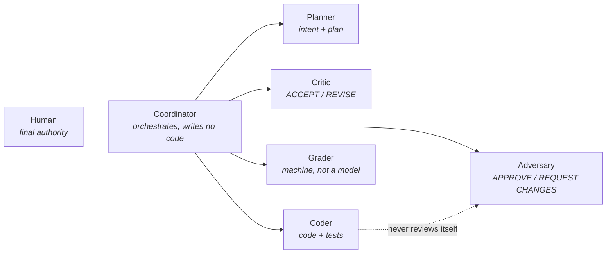
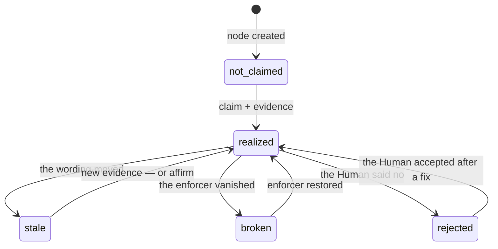
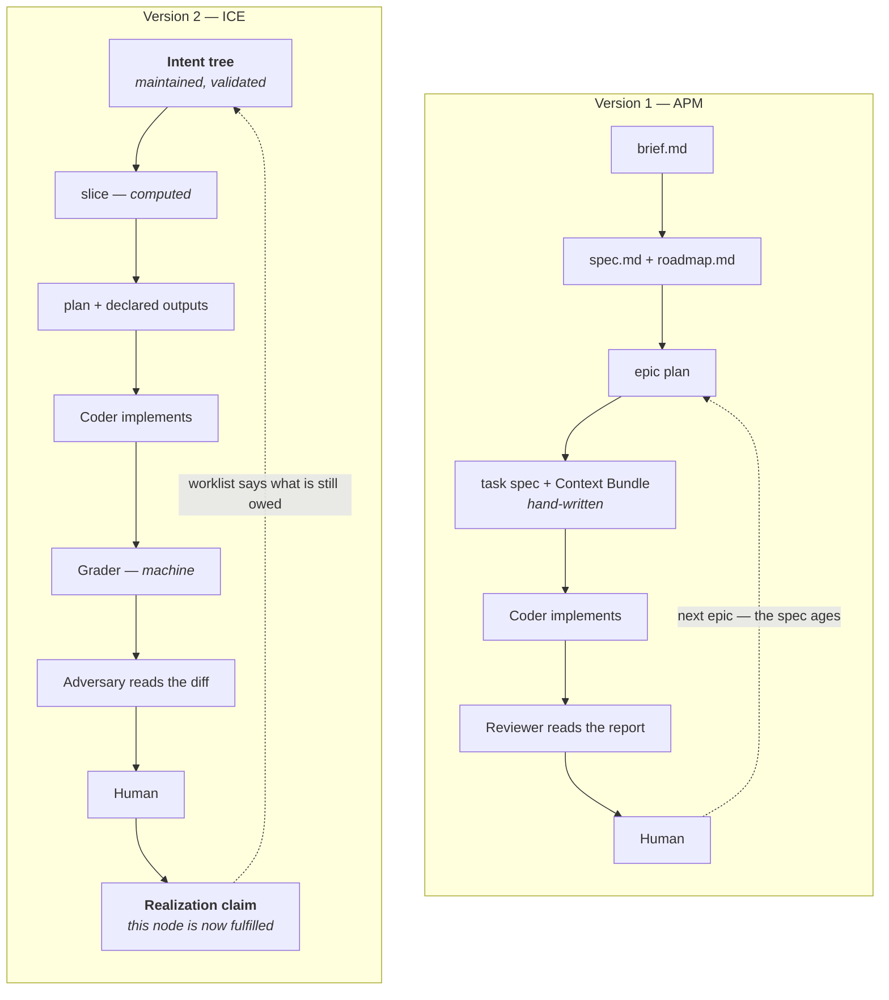

# Cursor-best-practices-template

A shared Cursor IDE configuration library — curated `.mdc` rules, agent skills and a
dependency-free toolchain that turn "AI writes code" into a process with a source of
truth and machine-checked proof.



---

## Status: version 2 (ICE)

**Version 2 replaces the project-management methodology of version 1.** Everything else —
language rules, Docker standards, development skills, git conventions — carries over
unchanged.

| | Version 1 | Version 2 |
|---|---|---|
| Methodology | APM — Agentic Project Management | ICE — Intent, Contract, Evidence |
| Source of truth | the last approved plan | `doc/intent/` — a maintained tree of meaning |
| Unit of work | Epic → Task | one **run** |
| Verification | reviewer reads the report | machine gates first, reviewer second |
| "What is left?" | the remaining tasks in the epic plan | computed: `intent realization worklist` |
| Tooling | none (prose only) | `tools/intent` + `tools/checks`, no dependencies |

Version 1 stays available: see [Pinning a version](#pinning-a-version).

### The idea in three questions



- **Intent** — a tree of nodes, one node per chapter of meaning. It is maintained, not
  written once. An agent reads it through a computed *slice*, never by browsing.
- **Contract** — every statement that must hold names the test or command that enforces
  it. A contract without an enforcer is a wish, and the tooling counts those.
- **Evidence** — a machine, not a model, decides whether the work is done. The commands
  live in `VERIFY.md`; the log lives with the run.

A fourth question follows from the three: **is it true yet?** That one is answered by the
[realization layer](#what-is-left-to-do--the-realization-layer).

---

## Setup

### 1. Mount the harness

```bash
# In your project root — the repo root maps directly to .cursor/
git submodule add git@github.com:ivomarvan/cursor-best-practices-template.git .cursor
git commit -m "chore(cursor): add shared cursor rules as submodule"
```

Cursor now discovers `.cursor/rules/` and `.cursor/skills/` with no further configuration.
If your project also needs its **own** rules, use the
[wrapper pattern](#adding-project-specific-rules-wrapper-pattern) instead.

### 2. Activate the git hooks (once per clone)

```bash
git config --local core.hooksPath .cursor/hooks/git
```

This strips the automatic Cursor attribution from commit messages.

### 3. Choose the chat language

The default is Czech. Edit only `.cursor/rules/00-communication-language.mdc` — rules,
skills and code stay in English regardless.

### 4. Decide the models

`.cursor/AGENT_MODELS.md` ships defaults for the five roles. It lives in the submodule,
so it is **read-only** for your project. To change models for this project only, create
`AGENT_MODELS.md` in the **project root** and restate just the roles you want to
override.

### 5. Write `VERIFY.md`

In your project root, list the commands that prove the project is in a valid state — the
test suite, the linter, the type checker — with their expected exit codes. This is the
Grader's entire mandate: it runs these and nothing else.

```markdown
| # | Command | Expected | Proves |
|---|---------|----------|--------|
| 1 | `docker compose run --rm app pytest` | exit 0 | behaviour |
| 2 | `docker compose run --rm app ruff check .` | exit 0 | style |
| 3 | `python3 .cursor/tools/intent/cli.py validate` | exit 0 | the intent tree |
| 4 | `python3 .cursor/tools/intent/cli.py realization check` | exit 0 | the realization layer |
```

Command 4 checks that the realization layer is *consistent*, not that the project is
finished — an unfinished project is the normal state.

### 6. Start the intent tree

```bash
python3 .cursor/tools/intent/cli.py new --slug system --title "<your product>"
```

Fill in `## Meaning`, `## Non-goals` and at least one contract, then promote the node from
`proposed` to `current`. The root is always your decision, not an agent's — everything
else in the tree hangs off it.

Then simply ask the agent for a change. The `ice-run` skill takes over from there.

### 7. Leave the realization layer empty

Nothing to do — that is the point. `doc/intent/_realization.yaml` is written the first
time something is claimed, and until then every node is honestly `not_claimed`. A missing
`doc/intent/_policy.yaml` means the default profiles; write the file only when you want
to change them. Ask `intent realization worklist` at any time to see what the project
still owes its own tree.

---

## How a change happens



Loops are bounded at three rounds; the fourth escalates to you. A scope violation raises
the run one level and wakes the reviewer even if the change looked trivial.

### Who is allowed to do what



Three separations carry the whole design: the Planner does not implement, the Coder does
not grade, and the Adversary uses a different model than the Coder.

---

## What is left to do — the realization layer

The tree says what the system **means**. It does not say whether the project already
**fulfils** it. Without that, "what should we do next?" has no source of truth: runs are
audit and may not be read as a backlog, and an empty `code_paths` is a guess, not a fact.

The realization layer answers it, and lives beside the tree rather than inside it.

### One rule: assertions are stored, state is computed

Stored, in `doc/intent/_realization.yaml`: that somebody claimed a node realized, with
evidence, **against fingerprints of the wording it was claimed against** — plus the human
verdict, if any.

```yaml
schema_version: 1
nodes:
  i0042:
    claim:
      evidence: doc/runs/20260816-1040-user-email-a7
      by: Coordinator
      contracts: sha256:9f3a1b7c2d4e5f60
      meaning: sha256:11cd7e33aa20b415
```

Computed, never written: whether the claim still holds, why it stopped holding, what is
blocked, and what to work on next.

Two fingerprints per node. **contracts** covers the `contracts` list; **meaning** covers
`## Refines`, `## Meaning`, `## Contracts`, `## Non-goals`, `parent` and `uses`. Renaming
a node, moving its `code_paths` or reordering its contracts changes neither — those are
not changes of what the node commits to.

This is why realization state is *not* in the node front matter: one typo fixed high in
the tree would otherwise rewrite every node file below it, and the short readable diff
that makes reviewing an intent change cheap would drown in machine bookkeeping. It also
means an inconsistent state — a realized child under an ancestor whose meaning moved —
cannot be stored at all, so no rule has to forbid it.



### Invalidation follows wording, never state

| From | To | Trigger |
|------|----|---------|
| a node | its whole subtree | its `contracts` **or** `meaning` fingerprint changed |
| a node | its direct `uses` consumers, **one hop** | its `contracts` fingerprint changed |
| a node | anything, via `talks_to` | never |

A node that is merely unproven propagates nothing, and an unclaimed ancestor does not
block its children. The alternative sounds stricter but inverts adoption: after bootstrap
nothing is claimed anywhere, so the first node you would have to prove is the root — the
least provable node in any tree. Project-wide compliance still requires that ancestor, so
nothing is actually lost.

### The worklist is the assignment

```bash
$ python3 .cursor/tools/intent/cli.py realization worklist
i0004  stale [own contracts changed]                    ready
i0007  stale [ancestor i0004 changed contracts]         blocked_by i0004
i0011  not_claimed                                      ready
i0002  broken [enforcer missing: c3]                    ready
i0003  realized, acceptance pending                     ready
```

The most general instruction a project can be given becomes: *bring every current node to
`realized`, and to `approved` where the policy asks for it.* Ancestors come first; a node
marked `blocked_by` waits, because fixing the ancestor may change what it needs.

`broken` deserves a note. A refactor that renames a test away is the most common way debt
appears, and it leaves the intent untouched — so no amount of watching the tree would
catch it. It is derived from the same check the validator uses for `enforced_by`.

### Who may write what

| Action | Who | Refused for |
|--------|-----|-------------|
| `claim` | Coordinator, once every gate the level requires has passed — at `low` the Grader, above it the Adversary too | the **Coder** — nobody grades their own work |
| `affirm` — keep a claim after a harmless edit | Human only | every agent role |
| `accept` / `reject` | Human only | every agent role |

These are recorded, not cryptographic, guarantees: whatever lands in `by` shows up in the
diff, which is exactly where the Adversary and you are already looking.

`affirm` is the answer to the deliberate bluntness of fingerprints. When a text change did
not really change the promise, one command — with a reason, optionally `--subtree` —
re-points the existing claims at the new wording without re-running anything. Deciding
that is a judgement, which is why only a human may make it.

### Policy

`doc/intent/_policy.yaml` holds two dials. `acceptance_profile` (`none`, `standard`,
`leaf`, `strict`) decides how often you must sign off; the default asks only where a
contract has no machine enforcer. `evidence_profile` (`standard`, `relaxed`) decides what
a claim must point at; `relaxed` exists for adopting a project that has tests but no run
history. Changing this file is a hard trigger for complexity `high`, like `VERIFY.md`.

The layer starts empty, so every node is `not_claimed` — which is the truth. Nothing is
assumed done just because it exists.

---

## Tooling

Pure Python 3.11+, no dependencies, no install step.

```bash
python3 .cursor/tools/intent/cli.py <command>   # in a project
python3 tools/intent/cli.py <command>           # inside this repo
```

| Command | Purpose |
|---------|---------|
| `validate` | machine rules V1–V10 over the tree; exit 1 on error |
| `map` | regenerate `MAP.md` and `INDEX.json` |
| `new --parent iNNNN --slug x` | allocate a short id and scaffold a node |
| `move iNNNN --parent iMMMM` | re-parent a node; the id never changes |
| `slice iNNNN --for plan\|implement` | the exact file list for one agent action |
| `scope --run <dir>` | working diff versus the outputs the plan declared |
| `coverage` | contracts with no machine enforcer; code owned by no node |
| `owner <path>` | which node governs this file |
| `realization worklist` | what the project still owes the tree, ancestors first |
| `realization status [--node iNNNN]` | derived state and the reason it went stale |
| `realization summary` | how much of the intent is realized |
| `realization claim iNNNN --evidence <run> --by <role>` | record fulfilment; never the Coder |
| `realization affirm iNNNN [--subtree] --by <you> --reason "…"` | keep a claim after a harmless edit |
| `realization accept iNNNN --by <you> [--reject]` | your verdict on a claim |
| `realization check` | the layer is internally consistent (R1–R7) |

The tool reads `doc/intent/` in the **project root** and ignores `.cursor/` completely —
the harness carries its own tree, and two registries would make every short id ambiguous.

---

## Repository structure

```
cursor-best-practices-template/
├── rules/          # .mdc rule files — Cursor reads these as .cursor/rules/
├── skills/         # Agent skill directories — Cursor reads as .cursor/skills/
├── commands/       # Slash commands — /push
├── hooks/          # Git + session hooks (commit-msg, session-start)
├── hooks.json      # Cursor hook registration
├── tools/
│   ├── intent/     # the intent tree CLI + its unittest suite
│   └── checks/     # contracts this repository declares about itself
├── doc/
│   ├── intent/     # this repository's own intent tree (the pilot)
│   │   ├── nodes/            # one node = one chapter of meaning
│   │   ├── _registry.yaml    # the id issuer
│   │   ├── _realization.yaml # claims about what is already fulfilled
│   │   ├── _policy.yaml      # when a human signs off, what counts as evidence
│   │   ├── MAP.md            # generated routing map — never edited by hand
│   │   └── INDEX.json        # generated machine index
│   └── guides/     # how-to guides
├── AGENT_MODELS.md # default model catalog for the five roles
├── VERIFY.md       # what proves this repository is in a valid state
└── .cursor/
    ├── rules  →  ../rules     # symlink — enables rules while editing this repo
    └── skills →  ../skills    # symlink — enables skills while editing this repo
```

This repository **uses its own methodology on itself**: `doc/intent/` describes the
harness, every contract there points at a real check, and `VERIFY.md` runs them.

---

## Rules and Skills

### Rules (`rules/`)

| File | Topic | Activation |
|------|-------|-----------|
| `00-communication-language.mdc` | Communication language setting (CS/DE/EN) | always |
| `00-meta-rules-and-skills.mdc` | How to write rules and skills | `**/.cursor/rules/**`, `**/SKILL.md` |
| `00-model-policy.mdc` | Role→model resolution, `AGENT_MODELS.md` catalog | on request |
| `01-general-programming.mdc` | OOP, SOLID, clean code, error handling, logging | always |
| `02-git.mdc` | Conventional commits, intent trailers, branching | always |
| `03-docker-policy.mdc` | When Docker is mandatory; exemptions | on request |
| `04-docker-standards.mdc` | Dockerfile standards, uv multi-stage, Compose Watch | `Dockerfile*`, `docker-compose*` |
| `05-new-technology.mdc` | Process for adding new technologies | on request |
| `06-project-structure.mdc` | Universal directory layout, `doc/`, ADRs | on request |
| `07-ice-workflow.mdc` | **ICE loop, roles, complexity, gates, escalation** | always |
| `07-intent-tree.mdc` | **Node schema, edges, axioms A1–A6, rules V1–V10** | `doc/intent/**` |
| `07-realization.mdc` | **Realization layer, fingerprints, worklist, R1–R7** | `doc/intent/**` |
| `07-run-artifacts.mdc` | **Run directory, DoR, DoD, report structure** | `doc/runs/**` |
| `08-agent-security.mdc` | Untrusted content, prompt injection, lethal trifecta | always |
| `09-testing.mdc` | Testing contract (unit / integration / E2E) | `**/tests/**` |
| `10-python.mdc` | Python 3.12+, uv, Ruff, Pyrefly/ty, pytest | `**/*.py`, `pyproject.toml` |
| `11-vuejs-vite-tailwind.mdc` | Vue 3.5 + Vite + Tailwind v4, oxlint, Playwright | `**/*.vue` |
| `12-cpp-esp32.mdc` | C/C++ ESP-IDF 5.4+, C++20, FreeRTOS, RAII | `**/*.c`, `**/*.cpp` |
| `13-sql-postgresql.mdc` | SQL conventions, Alembic, psycopg 3, roles | `**/*.sql` |
| `14-fastapi.mdc` | FastAPI, domain exceptions, pydantic-settings | `**/main.py` |
| `15-qdrant.mdc` | Qdrant client, collections, `query_points` | `**/*qdrant*.py` |
| `16-sqlalchemy.mdc` | SQLAlchemy 2.x ORM, async sessions, eager loading | `**/models.py` |
| `17-redis.mdc` | Redis usage, key naming, TTL, client patterns | `**/cache*.py` |
| `18-task-queue.mdc` | Taskiq default; Celery only with justification | `**/tasks.py` |
| `20-project-design-rules.mdc` | Honor project-root `DESIGN_RULES.md` | always |

### Skills (`skills/`)

| Directory | Role | Purpose |
|-----------|------|---------|
| `ice-run/` | Coordinator | drive one run from request to closure |
| `intent-change/` | Planner | create, insert, move or retire intent nodes |
| `ice-implement/` | Coder | implement inside the slice, with failing-test evidence |
| `ice-review/` | Adversary | independent review of the diff and the DoD |
| `commit-task/` | — | git commit workflow behind explicit trigger phrases |
| `docker-new-project/` | — | scaffold Dockerfile + compose + README.docker.md |
| `docker-debug/` | — | diagnose container and compose failures |
| `python-dev/` | — | Docker-based Python development workflow |
| `postgresql-dev/` | — | Docker-based PostgreSQL access and migrations |
| `vuejs-dev/` | — | Docker-based Vue.js development workflow |
| `qdrant-dev/` | — | Qdrant collections and testing |
| `sqlalchemy-dev/` | — | SQLAlchemy + Alembic scaffolding and migrations |

### Commands (`commands/`)

| Command | Purpose |
|---------|---------|
| `/push` | Run the project CI mirror; if green, stage, commit and push. Explicit exception to `02-git.mdc`. |

---

## What changed from version 1

### The process, side by side



The structural difference is the loop at the bottom. In version 1 the specification was
written once and aged; after a few epics nobody could say what still held. In version 2
the tree is the artifact that survives, every run both reads it and is checked against
it, and what the project still owes the tree is computed rather than remembered.

### Point by point

| | Version 1 (APM) | Version 2 (ICE) |
|---|---|---|
| **Planning** | Planner decomposes an Epic into Tasks; hand-written Context Bundle per task | Planner writes an intent delta and a run plan; context is **computed** by `intent slice` |
| **What is authoritative** | the most recently approved plan | `doc/intent/` nodes with `status: current` |
| **Acceptance criteria** | `dod.md` checklist, prose | Definition of Done where every item is an artifact or a command, plus contracts with `enforced_by` |
| **Verification order** | Coder claims → Reviewer reads the claim | machine gates run **first**; the reviewer sees the diff, not the story |
| **Reviewer wake-up** | every task | complexity-driven; a scope violation forces it |
| **Scope control** | "do not modify" list in the Context Bundle | `intent scope` compares the real diff with declared outputs |
| **Model policy** | role→model table inside a rule, `/role-assign` | `AGENT_MODELS.md` catalog with complexity bands and constraints |
| **Loop limits** | reviewer loop, max 3 | every loop bounded at 3, then escalation to the Human |
| **New tests** | "write tests" | failing-test evidence required: the test must fail on unchanged code |
| **Audit trail** | epic and task reports | run directory + `Intent:` / `Run:` commit trailers |
| **Remaining work** | whatever the epic plan still lists, and it ages with the plan | derived from claims against fingerprints; a changed sentence reopens exactly what it affects |
| **Tooling** | none | `validate`, `map`, `new`, `move`, `slice`, `scope`, `coverage`, `owner`, `realization` |

### What is gone

`rules/07-project-management.mdc`, the skills `project-init`, `plan-epic`,
`execute-task`, `review-task`, `review-epic`, the commands `/role-assign` and
`/role-show`, `README.project_management.md`, and the `doc/project-progress/` templates.

### What is unchanged

Every language and technology rule, every development skill, the git conventions, the
security rule, the hooks, and the submodule workflow. Version 2 is a replacement of the
planning layer, not a rewrite of the harness.

---

## Migrating a project from version 1 to version 2

Nothing in your product code changes. What changes is where meaning lives.

**Step 1 — update the submodule on a branch.**

```bash
git checkout -b chore/ice-v2
git submodule update --remote .cursor
git config --local core.hooksPath .cursor/hooks/git
```

**Step 2 — freeze the old artifacts, do not delete them.** Keep
`doc/project-progress/` as an archive and put one line at the top of every top-level
document there so agents stop reading it as a specification:

```markdown
> ARCHIVE (methodology v1). Not a specification. The truth about meaning lives in `doc/intent/`.
```

**Step 3 — create the root of the tree.**

```bash
python3 .cursor/tools/intent/cli.py new --slug system --title "<your product>"
```

Write the root from what you know today, not from the old `spec.md`. If a statement in
the old spec is no longer true, that is exactly the information the migration exists to
surface.

**Step 4 — add the first level of children.** One node per part of the system that has
its own meaning — not one per package. Give each `code_paths` and at least one contract
with a real `enforced_by`. Stop when `intent coverage` shows no production code outside
any node; you do not need the whole tree on day one.

**Step 5 — write `VERIFY.md`** with the commands you already run, plus
`python3 .cursor/tools/intent/cli.py validate` and
`python3 .cursor/tools/intent/cli.py realization check`.

**Step 6 — run one small change through `ice-run`.** Use something you understand
completely. The point is to find out whether the tree helps or whether it has bloated,
while the stakes are low.

**Step 7 — pay down the realization debt at your own pace.** Every node starts
`not_claimed`, and `intent realization worklist` is now your backlog. Two honest ways to
empty it: put a node through a normal run, or — if the project already has the tests but
no run history — set `evidence_profile: relaxed` in `doc/intent/_policy.yaml` and claim
against `VERIFY.md`. There is no third way, and no heuristic will mark anything done for
you.

**Step 8 — remove the archive** once nobody has needed it for a few weeks.

Migrate one project at a time. Two methodologies in one repository are worse than either
one alone, because an agent picks whichever lands in its context window first.

---

## Pinning a version

The submodule is pinned to a commit, so each project moves to version 2 when you decide.

```bash
# stay on version 1
cd .cursor && git checkout v1 && cd ..
git add .cursor && git commit -m "chore(cursor): pin harness to v1"

# move to version 2
cd .cursor && git fetch --tags && git checkout v2 && cd ..
git add .cursor && git commit -m "chore(cursor): move harness to v2 (ICE)"

# track the tip of the default branch instead of a tag
git submodule update --remote .cursor
```

Check what a project currently uses with `git submodule status`.

---

## Adding project-specific rules (wrapper pattern)

When a project needs its own rules **in addition to** the shared ones, do not mount this
repo directly at `.cursor/`. Use a wrapper:

```bash
# 1. Add the template as a submodule at a named path (not .cursor)
git submodule add git@github.com:ivomarvan/cursor-best-practices-template.git .cursor-shared

# 2. Create your project's .cursor/ with symlinks to the shared files
mkdir -p .cursor/rules .cursor/skills
for f in .cursor-shared/rules/*.mdc; do
  ln -s "../../${f}" ".cursor/rules/$(basename $f)"
done
for d in .cursor-shared/skills/*/; do
  ln -s "../../${d%/}" ".cursor/skills/$(basename $d)"
done
ln -s ../.cursor-shared/tools .cursor/tools

# 3. Add project-specific rules directly into .cursor/rules/
```

Resulting layout:

```
your-project/
├── .cursor/
│   ├── rules/
│   │   ├── 07-ice-workflow.mdc   →  ../../.cursor-shared/rules/...  (symlink)
│   │   └── 20-project-specific.mdc   ← your own rule, tracked in your repo
│   ├── skills/
│   │   ├── ice-run/              →  ../../.cursor-shared/skills/...  (symlink)
│   │   └── my-custom-skill/      ← your own skill, tracked in your repo
│   └── tools/                    →  ../.cursor-shared/tools          (symlink)
├── .cursor-shared/               ← this template repo as submodule
└── doc/intent/                   ← your project's intent tree
```

Re-run the symlink loop after an update that adds new files upstream.

---

## Git submodule guide

### Cloning a project that has a submodule

```bash
git clone --recurse-submodules git@github.com:<you>/<your-project>.git

# if you already cloned without it:
git submodule update --init --recursive
```

Without `--recurse-submodules`, `.cursor/` exists but is **empty**.

### Updating to the latest harness

```bash
git submodule update --remote .cursor
git add .cursor
git commit -m "chore(cursor): update shared rules to latest"
```

### Contributing a change back to the harness

```bash
cd .cursor
git checkout master && git pull
# edit, then verify before committing:
python3 tools/intent/cli.py validate \
  && python3 tools/intent/cli.py realization check \
  && python3 -m unittest discover -s tools/intent/tests -t tools \
  && python3 tools/checks/template_checks.py --root . \
  && python3 tools/checks/hook_checks.py --root .
git add rules/15-qdrant.mdc
git commit -m "feat(qdrant): add vector database rule"
git push
cd ..
git add .cursor && git commit -m "chore(cursor): update shared rules"
```

The parent project stores only a commit SHA, so after pushing inside the submodule you
must also commit the moved pointer in the parent.

### Status and removal

```bash
git submodule status            # which commit each submodule is pinned to
git diff --submodule            # what the pointer moved across

git submodule deinit -f .cursor # remove
git rm -f .cursor
rm -rf .git/modules/.cursor
```

---

## Keeping a fork up to date

```bash
git remote add upstream git@github.com:ivomarvan/cursor-best-practices-template.git
git fetch upstream
git merge upstream/master
# conflicts are typically in 00-communication-language.mdc and AGENT_MODELS.md
```
