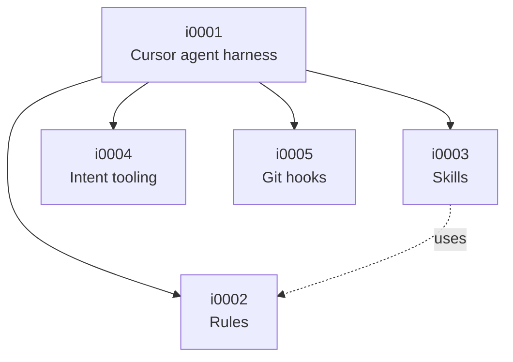

# Intent map

<!-- generated by `intent map` — do not edit by hand -->

| Id | Path | Title | Contracts | Code |
|----|------|-------|-----------|------|
| `i0001` | `i0001` | Cursor agent harness | Relative links inside rules and skills resolve to existing files; Cursor discovers rules and skills through the .cursor symlinks | — |
| `i0002` | `i0001/i0002` | Rules | Every rule declares its activation: description, globs, or alwaysApply true; An always-applied rule stays within 150 lines, a scoped rule within 250 | `rules/` |
| `i0003` | `i0001/i0003` | Skills | Every skill directory holds a SKILL.md declaring name and description; A skill stays within 500 lines | `skills/` |
| `i0004` | `i0001/i0004` | Intent tooling | Node front matter survives a dump and parse round trip unchanged; Constructs outside the supported YAML subset are rejected, never ignored; A structurally correct tree produces no validator errors; code_paths may overlap only along the ancestor chain, never between siblings; A contract pointing at a missing test is an error, not a warning; A slice carries ancestors and semantic dependencies but never siblings; Path and depth exist only in generated views, never in a node file; A change of a node's meaning invalidates the claim that it was realized; An unproven ancestor never blocks a proven child; Invalidation across a uses edge stops after one hop; A contract whose enforcer disappeared reaches the worklist instead of staying realized; A realization claim signed by the Coder is refused; A human acceptance signed with an agent role is refused; The scope guard always allows the realization layer, so a run cannot trip its own gate; A change of contracts on a uses target opens its consumer; A change of meaning on a uses target never reaches its consumer; An enforcer renamed to a longer symbol counts as missing, not as still present | `tools/` |
| `i0005` | `i0001/i0005` | Git hooks | The commit-msg hook removes agent attribution and keeps everything else; Every shipped hook is executable | `hooks/` |

## Tree

